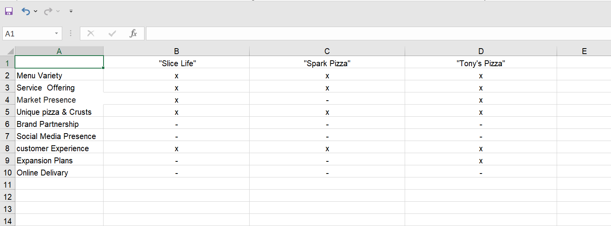

# FinalGroup

#Signin Sheet

| Date        | vinod Sign-in    | T sujith Sign-in |
|-------------|------------------|------------------|
| Nov 7, 2023 |      X           |       X          |
| Nov 9, 2023 |      X           |       X          |            
| Nov 14, 2023|      X           |       X          |
| Nov 16, 2023|      X           |       X          |
| Nov 21, 2023|      X           |       X          |
| Nov 23, 2023|                  |                  |
| Nov 28, 2023|                  |                  |
| Nov 30, 2023|                  |                  |
| Dec 5, 2023 |                  |                  |
| Dec 7, 2023 |                  |                  |
| Dec 12, 2023|                  |                  |

# Meeting Sheet

| Date        |     vinod        |     T sujith     |
|-------------|------------------|------------------|
| Nov 7, 2023 |       X          |       X          |
| Nov 9, 2023 |       X          |       X          |            
| Nov 13, 2023|       X          |       X          |

-Figma Link -[here](https://www.figma.com/file/7WDtgAsxx5uEsr9LPV1db2/Untitled?type=design&node-id=0-1&mode=design&t=pAz5mLgMwKwYxuET-0)

# Compitative Analysis  

# SWOT Analysis

# Persona

# Customer journey

# User Story

